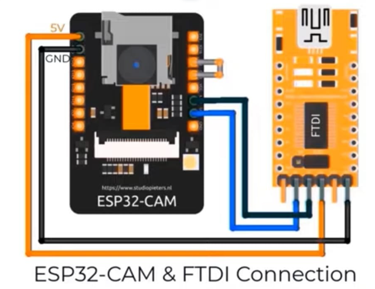

# GuideX

Smart Mobility Aid for the Visually Impaired

## Overview
GUIDEX is an AI-powered smart mobility assistance system designed to help visually impaired individuals navigate safely and independently. The system combines computer vision, edge AI, and real-time audio feedback using an ESP32-CAM-based wearable device.

### Key Objectives
- Real-time obstacle detection
- Environmental awareness
- Low-latency edge processing
- Smart navigation assistance
- Affordable and portable assistive technology

---

## Features
- Real-time object detection using Computer Vision
- Audio-based navigation alerts
- Edge processing for reduced latency
- Wireless communication using Bluetooth/Wi-Fi
- Lightweight and wearable design
- Low-cost implementation using ESP32-CAM

---
## Connections

## Contributors
- Deeptha Bandi

- Tejaswi Bellapu
